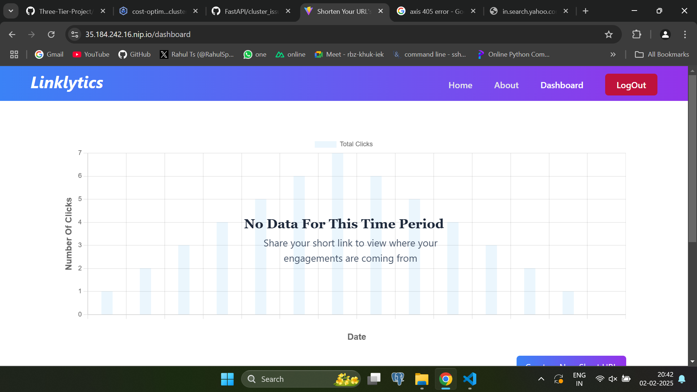
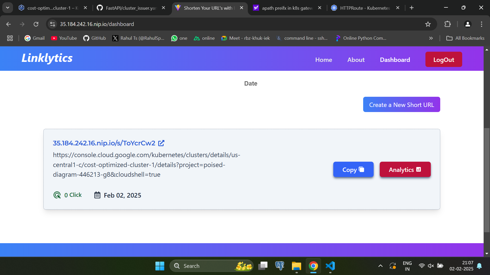
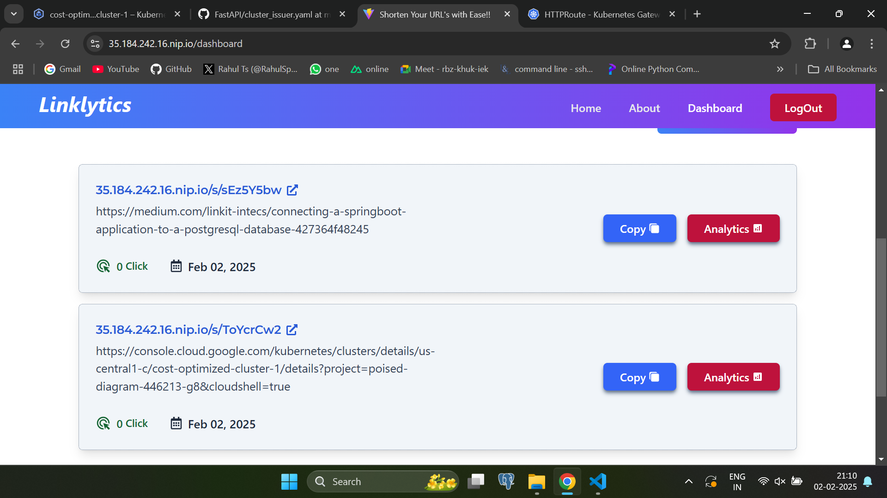
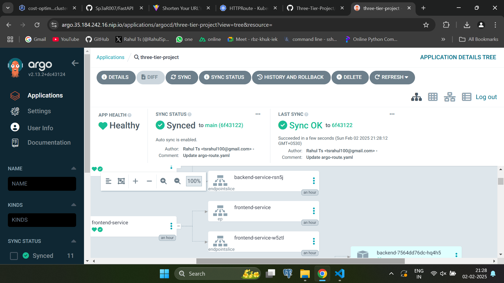

This is Kubernetes deployment details using CloudnativePG as Database, ArgoCD for continuous deployment and Gateway API for routing and TLS  .

# Kubernetes Deployment

## Installing basic componenets cert manager, nginx fabric for Gateway API

### Cert Manager

```
kubectl apply -f https://github.com/cert-manager/cert-manager/releases/download/v1.15.3/cert-manager.yaml
```
### Edit cert-manager deployment
```
- --enable-gateway-api
```
```
kubectl rollout restart deployment cert-manager -n cert-manager
```
### Install Nginx Fabric Gateway
```
kubectl kustomize "https://github.com/nginxinc/nginx-gateway-fabric/config/crd/gateway-api/standard?ref=v1.3.0" | kubectl apply -f -
helm install ngf oci://ghcr.io/nginxinc/charts/nginx-gateway-fabric --create-namespace -n nginx-gateway
```
## Install Cloudnative Postgres DB
```
kubectl apply --server-side -f https://raw.githubusercontent.com/cloudnative-pg/cloudnative-pg/release-1.23/releases/cnpg-1.23.1.yaml
```
## Deploy PostgresDB cluster 
```
kubectl apply -f postgres-cluster.yaml
```
## Create secret for Postgres cluster
```
kubectl apply -f secret.yaml
```

## Change password for database user springboot for the application
```
kubectl exec -it my-postgresql-1 -- psql -U postgres -c "ALTER USER springboot WITH PASSWORD 'postgres';"
```

## Create Backend deployment and service
```
kubectl apply -f backend-deploy.yaml
kubectl apply -f backend-service.yaml
```
## Create Frontend deployment and service
```
kubectl apply -f frontend-deploy.yaml
kubectl apply -f frontend-service.yaml
```
## Create Gateway 
```
kubectl apply -f gateway.yaml
```

## Create route for application
```
kubectl apply -f app-route.yaml
```
## Issue certificate for the application 
```
kubectl apply -f cluster_issuer.yaml
```

# Argocd Installation
```
kubectl create namespace argocd
kubectl apply -n argocd -f https://raw.githubusercontent.com/argoproj/argo-cd/stable/manifests/install.yaml
kubectl patch configmap argocd-cmd-params-cm  -n argocd --patch '{"data":{"server.insecure":"true"}}'
kubectl rollout restart deployment argocd-server -n argocd
kubectl get secret --namespace argocd argocd-initial-admin-secret -o jsonpath="{.data.password}" | base64 --decode ; echo 
```
## Create route and refernce grant for ArgoCD 
```
kubectl apply -f argo-route.yaml
kubectl apply -f referencegrant.yaml
```

# Deployment details

## Kubernetes deployment 







## ArgoCD Continuous Deployment


