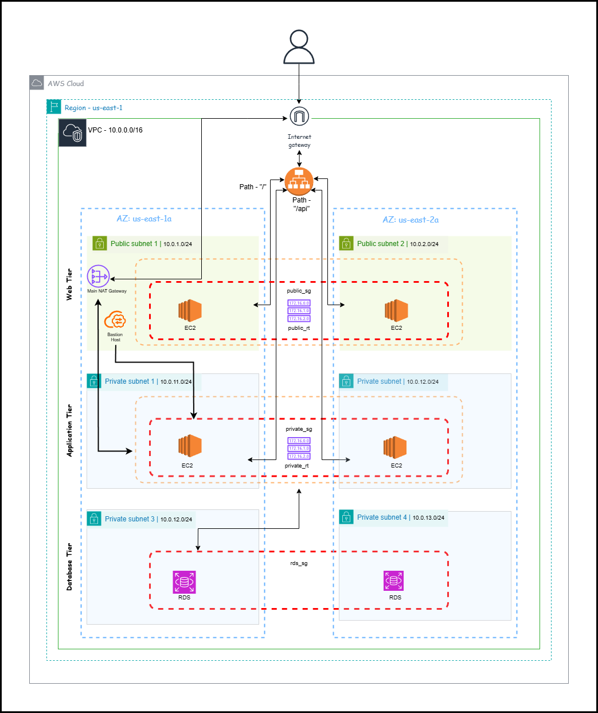
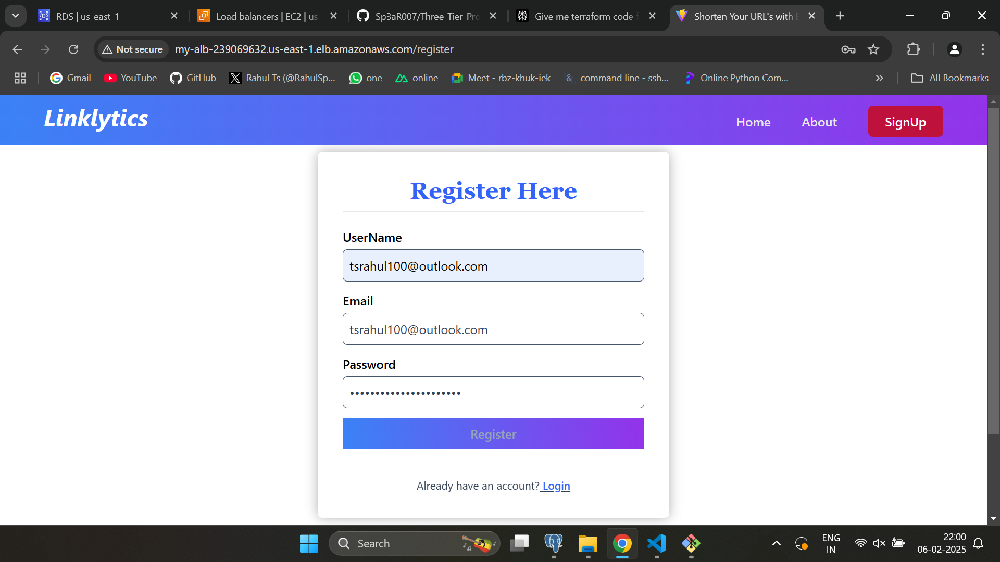
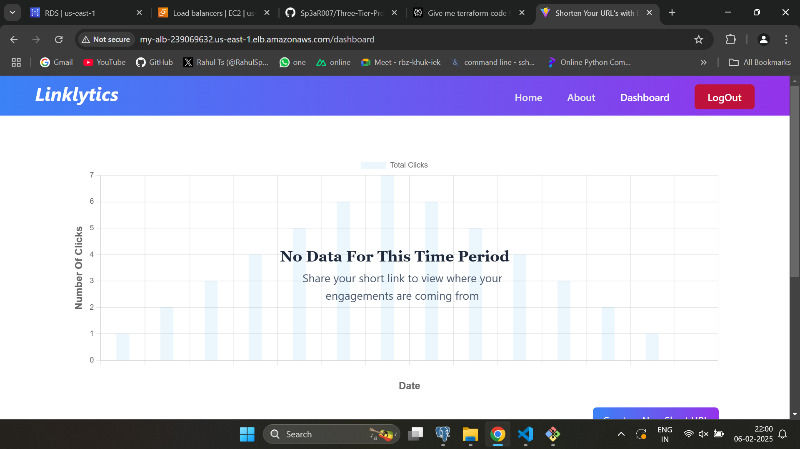
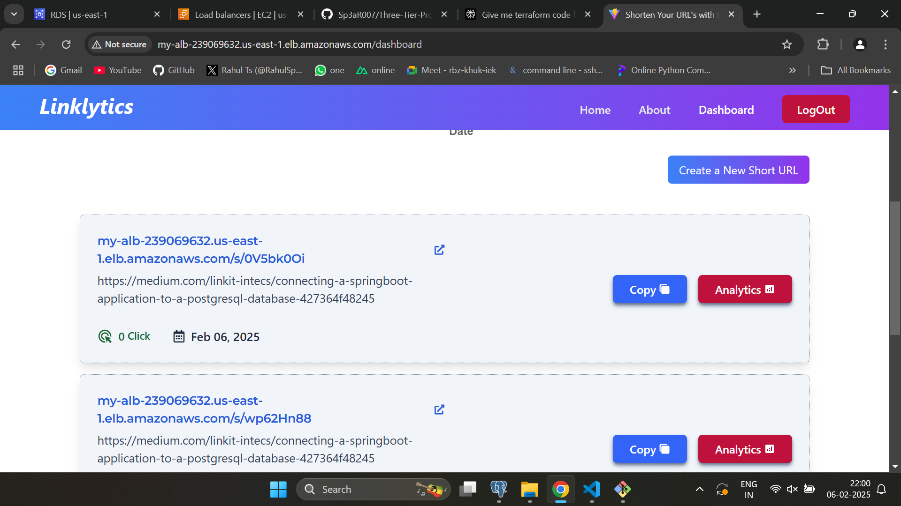

This contains Terrafrom configurations to deploy and manage AWS infrastructure as code. This is a three tier application which has a application load balancer, frontend instances in public subnet, backend and database instances in private subnet.

# Architecture for application on AWS 



## Enter the AWS credentials [Link to AWS CLI](https://docs.aws.amazon.com/cli/latest/userguide/getting-started-install.html)

```
aws configure
```

# Terraform cnfiguration

## Intialise the terraform
```
terraform init
```

## Create an execution plan
```
terraform plan
```

## Apply the configuration 
```
terraform apply 
```

## Destroying resources
```
terraform destroy
```

# Deployment details

## Application configured with Application Load Balancer



## Configured to backend and logged in with backend



## Configured to database and retreiveing data from database



