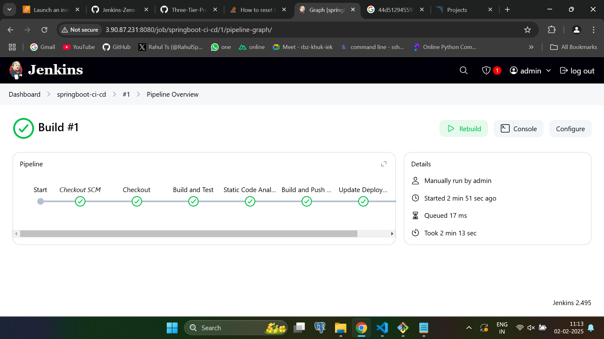
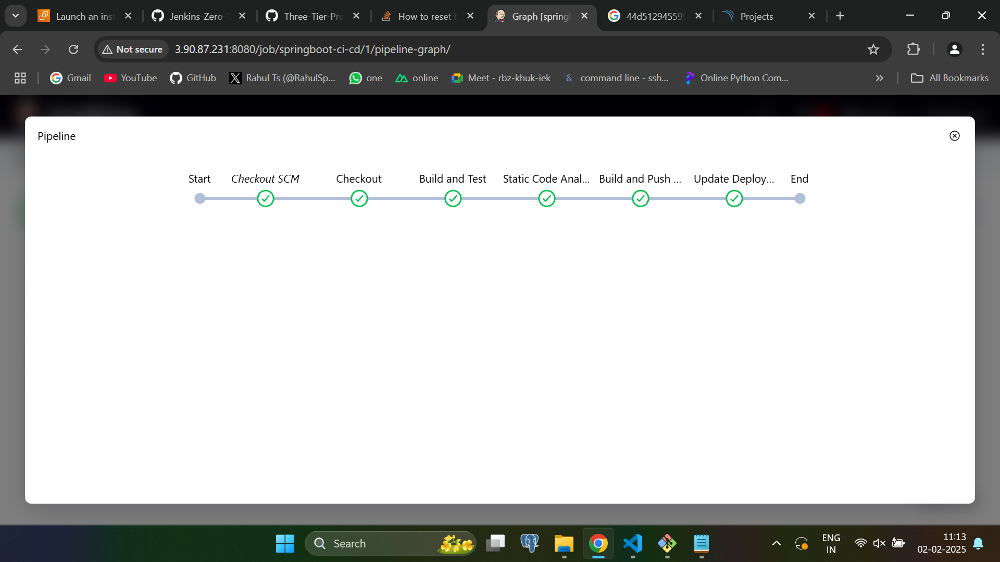
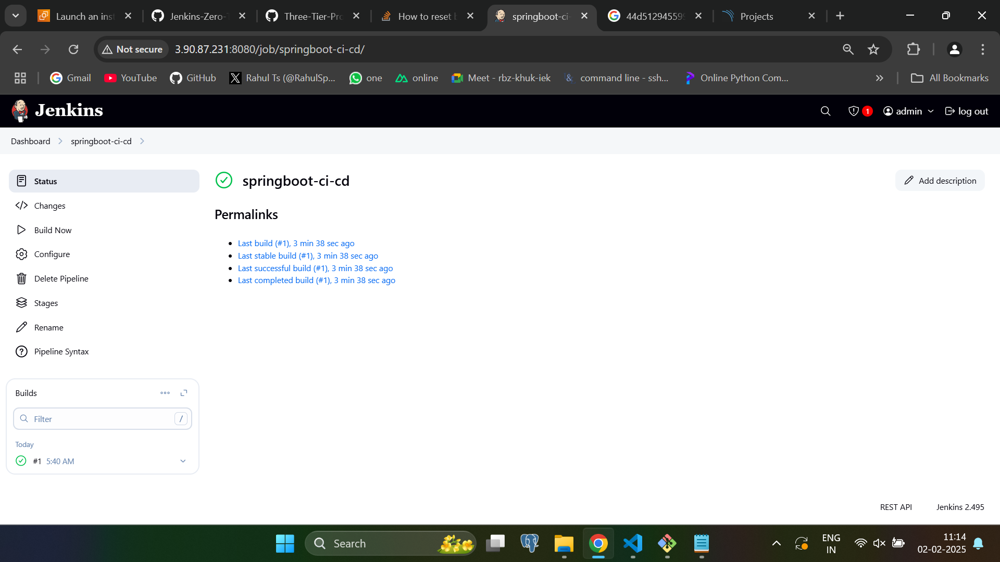
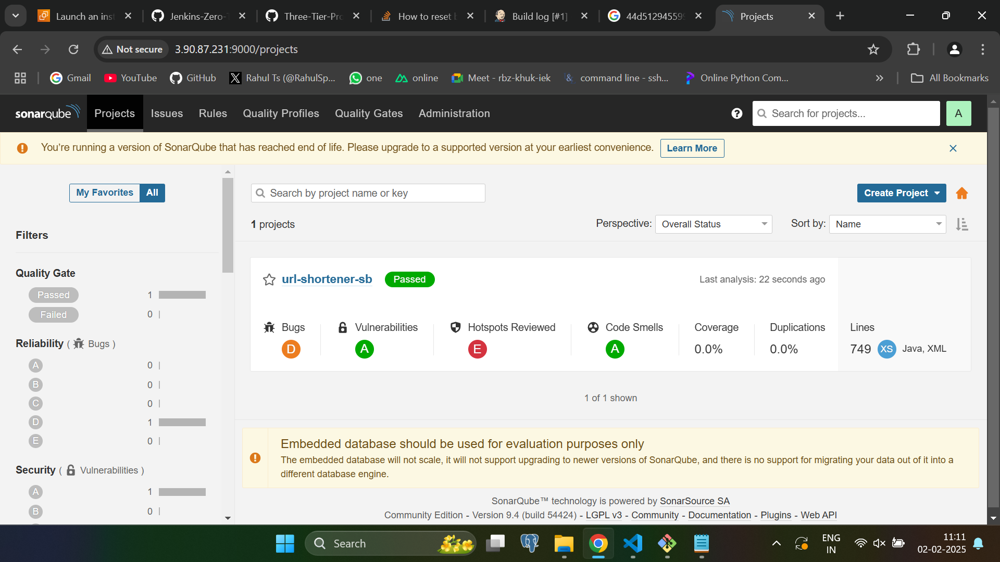

This is the Backend of the project developed with springboot, maven and Relational Database. This uses Jenkins for CI/CD.


# Install

## Install dependencies
```
./mvnw dependency:go-offline
```

## Build the application artifact
```
./mvnw clean package -DskipTests
```

# Docker 

## Build the docker image
```
docker build -t sp3ar007/url-shortener-be .
```
## Create the docker network for the application
```
docker network create app
```

## Run the postgres docker image for the application
```
docker run -d \
  --name postgres \
  --network app \
  -e POSTGRES_PASSWORD=postgres \
  -e POSTGRES_DB=urlshortenerdb \
  -e POSTGRES_USER=postgres \
  postgres
  
```

## Run the docker image
```
docker run -d \
  --network app \
    --name backend \
  -p 8080:8080 \
  -e DATABASE_URL=jdbc:postgresql://postgres:5432/urlshortenerdb \
  -e DATABASE_USERNAME=postgres \
  -e DATABASE_PASSWORD=postgres \
  -e DATABASE_DIALECT=org.hibernate.dialect.PostgreSQLDialect \
  -e FRONTEND_URL=http://localhost \
   sp3ar007/url-shortener-be:1
```

# Jenkins 

## CI/CD with Jenkins





## Build with Jenkins




# SonarQube


## Code Analysis





